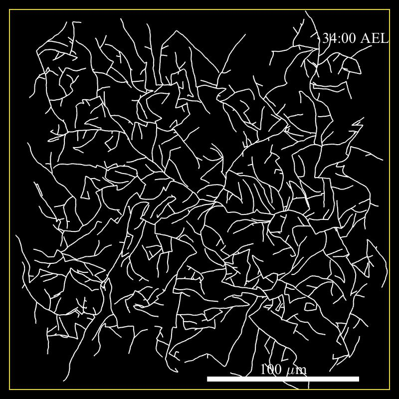
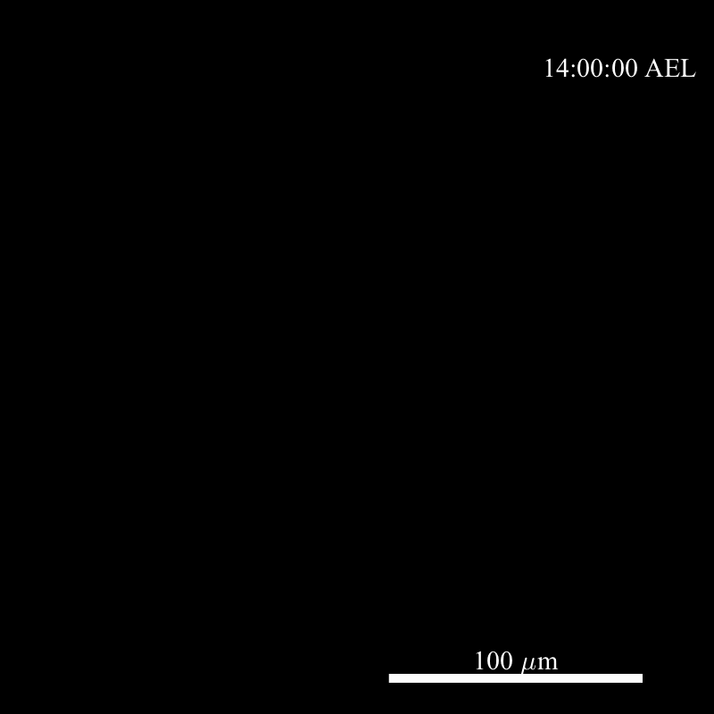

# Self-avoiding branching tree (sabt)
Matlab codebase to simulate the growth of a self-avoiding branching tree in 2D.

# Getting started
Run `setup.m` to add the library of routines to the search path.

`sabt.m` is the main routine that simulates the growth of a tree. See comments for documentation on the parameters. `Examples.m` demonstrate how to call `sabt.m` using various sets of parameters.

# Model
`sabt.m` simulates the growth of a 2D tree whose branches avoid each other. The simulation is intended to model the development of dendritic trees in class IV neurons of *Drosophila melanogaster* larva.

## Rules of growth
There are 3 main rules that determine key aspects of the growth of self-avoiding branching trees. These rules answer the following questions:

1. How do branches form?
2. How do branches grow?
3. How do branches interact with one another?

### 1. Branch formation
The mechanism by which new branches are added to the tree is called *branching*. Several rules are implemented to model branching including constant branching and extensive branching whereby the total branching rate scales with the total branch length in the tree. The branching mechanism is controlled by the optional parameter `Branching_rule`. Details of several branching mechanisms are given in the branching rules section in `sabt.m`. Once the branching rate is determined at a given time frame, the number of new branches is determined by sampling a Poisson distribution with a mean given by the branching rate.

### 2. Branch growth
Two different mechanisms are implemented to model branch growth.

In the first mechanism, branches are assumed to go through 3 different dynamical states that determine their growth dynamics. The states are: Shrinking (S), Paused (P) and Growing (G). Transitions between the states is a Markov process that is governed by a transition rate matrix $T$:

$$\vec{S}(t + \Delta t) = e^{\Delta t T} \vec{S}(t)$$

where $\vec{S}(t)$ denotes the probability of a branch to be in either of the 3 states at time $t$. In a given state, the growth velocity of a branch is given by sampling a velocity distribution. A different velocity distribution is associated to each of the 3 states.

In the second mechanism, the change in length of a branch is determined by a 1D drift-diffusion process, also known as a biased random walk. For this growth mechanism, the change in length $\Delta L$ over a time step $\Delta t$ is given by the following expression:

$$\Delta L = V \Delta t + \sqrt{2 D \Delta t} \epsilon$$
where $\epsilon$ is a standard normally distributed random variable, $V$ denotes the drift velocity and $D$ denotes the diffusion coefficient.

Finally, the growth direction of a branch is determined by the persistence length of the growth, which is parameterized by $\beta$. When a branch grows by a length of $\delta$, the angle of growth changes by a random variable $\Delta \theta$ that is normally distributed with mean = 0 and variance = $\frac{2\delta}\beta$.

### 3. Branch retraction

Upon collision with another branch, branches stop growing to ensure the self-avoidance property. Several events may occur after a collision.

In the `3state` tip dynamics model, the transition dynamics and state velocity distribution can change for a given duration before it goes back to the nominal dynamics. This is controlled by the optional parameter `TipsParamsPostCollision`. The duration of the post-collision dynamics is controlled by `alpha`.

In the `drift_diff` tip dynamics model, collisions simply prevent further growth but do not change the dynamics. This implies that surrounding branches  act as reflective walls with respect to the dynamics of the colliding branch.

# Examples
For all examples given below, the base parameters are saved in `base_parameters.mat` in the `data` folder. Some of these parameters are overwritten in the examples below.

The simulations are run for 20 hours and the clock is initialized at 14 hours after-egg-lay (AEL), which corresponds approximately to the beginning of dendritic morphogenesis in class IV neurons.

## Example 1: Constant branching rate
The tree is grown using a constant branching rate of 0.1 branches/min.

## Example 2: Scaled branching rate
The total branching rate &Omega; is a function of the total branch length L such that &Omega; = &omega;L. &omega; is initially high and decays exponentially with time and reaches a constant value of 0.01 branches/&mu;m/min.

## Example 3: Scaled branching rate and boundary
This example is similar to example 2 with the additional feature of a rectangular boundary that prevents growth. The boundary is used to model the compartmentalization of the neurons during development.

## Example 4: Drift-diffusion growth with scaled branching rate and boundary
In this last example, branches grow according to a drift-diffusion model. The drift velocity is 0.05 &mu;m/min and the diffusion constant is 0.2 &mu;m^2/min.

